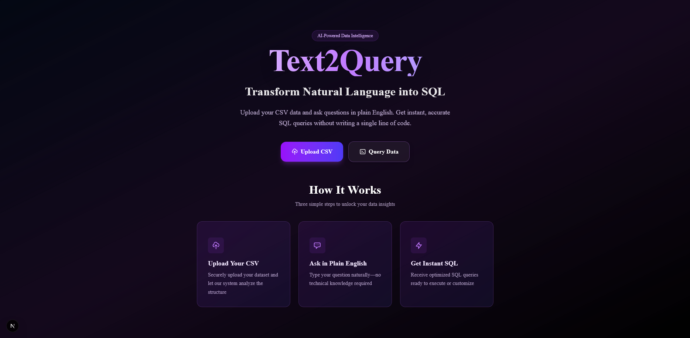

# Text2Query

Text2Query is an AI-powered web application that converts natural language questions into SQL queries for your CSV data. Upload your dataset, ask questions in plain English, and get instant, accurate SQL queries and results—no SQL expertise required.

---

## Features
- **AI-Powered Text-to-SQL:** Converts natural language to SQL using LLMs (Groq, LangChain, etc.)
- **CSV Upload:** Securely upload your CSV file and explore its data structure
- **Instant Querying:** Ask questions and get SQL + results instantly
- **Modern UI:** Beautiful, responsive frontend with a professional purple theme (Next.js, Tailwind CSS)
- **Backend API:** FastAPI backend for CSV ingestion and LLM-powered SQL generation

---

## Screenshots
<p align="center">
	
</p>

<p align="center"><i>Text2Query – AI-powered text-to-SQL web app</i></p>

---

## Getting Started

### Prerequisites
- Node.js (for frontend)
- Python 3.10+ (for backend)
- [Groq API Key](https://console.groq.com/) (for LLM-powered SQL)

### 1. Clone the Repository
```bash
git clone https://github.com/Abs-Futy7/Text2Query.git
cd Text2Query
```

### 2. Backend Setup
```bash
cd backend
python -m venv .venv
.venv\Scripts\activate  # On Windows
pip install -r requirements.txt
```

Create a `.env` file in `backend/` with your Groq API key:
```
GROQ_API_KEY=your_groq_api_key_here
```

Start the backend server:
```bash
uvicorn server:app --reload --port 8000
```

### 3. Frontend Setup
```bash
cd ../frontend
npm install
npm run dev
```

Visit [http://localhost:3000](http://localhost:3000) to use the app.

---

## Usage
1. **Upload CSV:** Click "Upload CSV" and select your data file.
2. **Ask Questions:** Go to "Query Data" and type your question in plain English.
3. **Get SQL & Results:** Instantly see the generated SQL and query results.

---

## Project Structure
```
Text2Query/
├── backend/      # FastAPI backend, LLM logic, database
├── frontend/     # Next.js frontend, UI components
├── screenshots/  # App screenshots (add your own)
└── students.csv  # Example CSV file
```

---

## Technologies Used
- **Frontend:** Next.js, React, Tailwind CSS
- **Backend:** FastAPI, LangChain, Groq, Uvicorn, Pandas
- **LLM:** Groq API (LLM for text-to-SQL)

---

## Security
- **Never commit your `.env` or API keys to git.**
- Add `backend/.env` to `.gitignore` (already included).
- If a secret is accidentally committed, follow [GitHub's secret removal guide](https://docs.github.com/en/code-security/secret-scanning/removing-a-secret-that-has-been-committed-to-your-repository).

---

## License
[MIT](LICENSE)

---

## Credits
- Built by Abs-Futy7
- Powered by Groq, LangChain, and the open-source community
